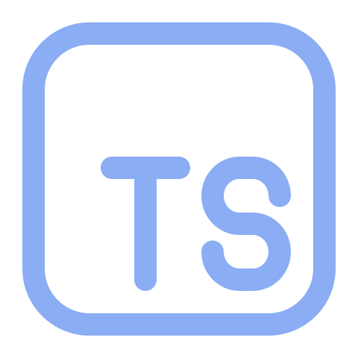
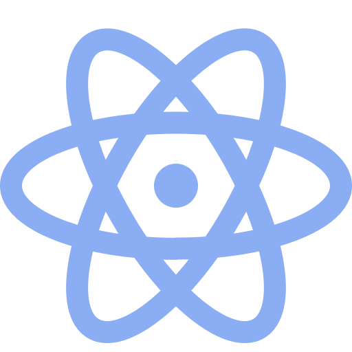
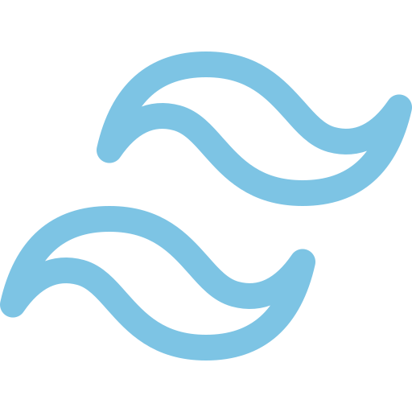
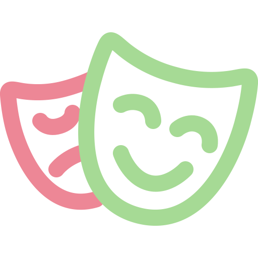
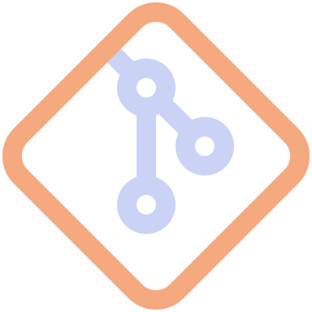
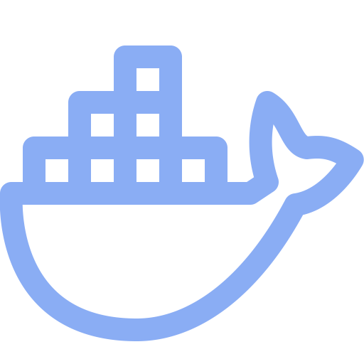
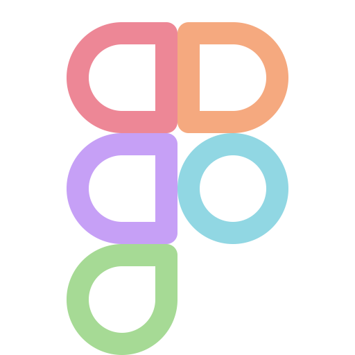

# Hey 👋 I'm Dan

<!-- <h3 align="center">A passionate developer</h3> -->

📬 Text me: lyatorovskiy@yandex.ru

📝 Resume: [(ru)](resume.pdf) [(eng)](resume_eng.pdf)

#### Languages

   
  
  
  

#### Libraries and frameworks

  
  <!---    --->
  
  <!---   --->
  
  
  
#### Other

  
  
  
  
